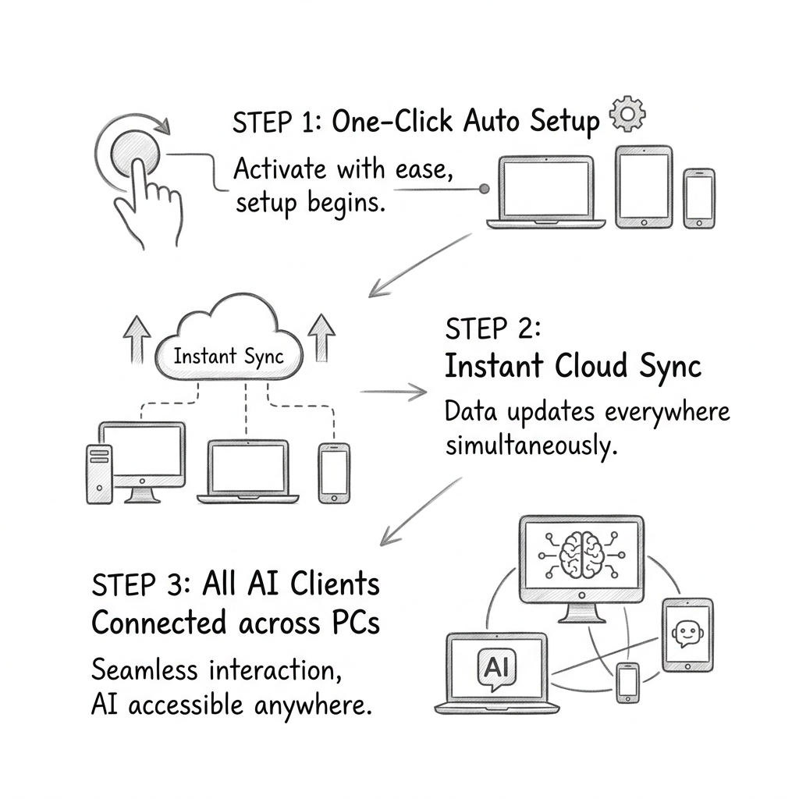

# skill-sync 🔄


```text
╭──────────────────────────────────────────────────────────────────╮
│  ╔═╗╦╔═╦╦  ╦    ╔═╗╦ ╦╔╗╔╔═╗                                     │
│  ╚═╗╠╩╗║║  ║    ╚═╗╚╦╝║║║║     skills that follow you around     │
│  ╚═╝╩ ╩╩╩═╝╩═╝  ╚═╝ ╩ ╝╚╝╚═╝   Created by GTI Santander          │
╰──────────────────────────────────────────────────────────────────╯
```

> **Created by GTI Santander** — Zero-Friction AI Skill Synchronization for Teams & Developers.

Sync your AI skills across all your computers and AI clients (**Claude Code**, **Gemini**, **Antigravity**, **Cursor**, **OpenCode**) through any cloud provider (**Google Drive**, **Dropbox**, **OneDrive**, **S3**, **Box**, **WebDAV**, or **Local Storage**), organized into categories.

---

## ⚡ Super-Easy Setup Guide (English)



### 1-Click Automatic Installation (Zero-Friction)

No manual configuration needed. Just clone or copy the skill and run **one command**:

```bash
# Clone / Copy skill-sync to your skills folder
# Windows:   %USERPROFILE%\.gemini\config\skills\skill-sync\
# Linux/Mac: ~/.claude/skills/skill-sync/

# Run the 1-Click Zero-Friction Auto-Installer
python scripts/install.py
```

`install.py` automatically:
1. Detects your OS and **installs Rclone** if missing (`winget`, `brew`, or `curl`).
2. Configures default storage and skill categories (`work`, `school`, `personal`).
3. Registers automatic session hooks in your AI client.
4. Completes in **1 second with ZERO questions asked**.

---

## 🌟 Key Features & Architecture

```text
[System Skill Locations]                             <remote>:ClaudeSkills/
  ~/.claude/skills/        [Claude]   \                  manifest.json
  ~/.gemini/config/skills/ [Gemini]    ├─ sync.py ──>    work/web-builder/
  .agents/skills/          [Agents]   /                  school/thesis-helper/
                                                         personal/recipe-notes/
```

- **🖥️ System-Wide Multi-Directory Detection**: Automatically scans all skill locations across your PC (`~/.claude/skills/`, `~/.gemini/config/skills/`, `.agents/skills/`, and custom paths). Installing a skill anywhere is detected instantly.
- **⚡ 1-Click Auto-Installer**: `python scripts/install.py` auto-installs Rclone and session hooks out-of-the-box.
- **🤖 Agent-First & JSON Ready**: Native `--json` output flags on all subcommands (`status`, `push`, `doctor`, `merge`) for seamless integration with AI agents.
- **🔀 Smart Markdown Merge (`merge`)**: Line-by-line unified diff inspection for `SKILL.md` files before resolving conflicts.
- **🎨 Interactive TUI Menu (`menu.py`)**: Full-screen terminal UI with origin badges (`[Claude]`, `[Gemini]`, `[Agents]`), Vim keybindings (`j`/`k`), live filtering, and interactive diff viewer.
- **🔐 Credential Guard**: Scans skills before upload to prevent accidental leakage of API keys (OpenAI, Anthropic, GitHub, AWS, Google API) and private key blocks.
- **🗑️ Trash Backup System**: Non-destructive sync. Replaced files land in a timestamped `.trash/` directory on both local and remote.

---

## 📖 Complete Skill Lifecycle Rundown

Here is the step-by-step workflow for managing your skills across machines:

### 1. Check System Status
Scans all skill directories on your PC and compares them with the remote:
```bash
python scripts/sync.py status
# Agent mode (JSON output):
python scripts/sync.py status --json
```

### 2. Categorize a New Skill
Assign a category (`work`, `school`, `personal`, or custom) to a newly detected skill:
```bash
python scripts/sync.py categorize my-new-skill work
```

### 3. Upload to Remote (`push`)
Upload local changes to your cloud remote:
```bash
python scripts/sync.py push                     # Push all local changes
python scripts/sync.py push my-new-skill        # Push specific skill
python scripts/sync.py push --no-scan           # Bypass credential scan if verified
```

### 4. Download from Remote (`pull`)
Download skills by category or specific name on a second computer:
```bash
python scripts/sync.py pull                     # List remote categories
python scripts/sync.py pull work personal       # Download categories
python scripts/sync.py pull --skills my-skill   # Download specific skill
```

### 5. Inspect Markdown Diffs (`merge`)
Inspect line-by-line diffs of `SKILL.md` when local and remote versions differ:
```bash
python scripts/sync.py merge my-skill           # View unified diff
python scripts/sync.py merge my-skill --json    # Output diff in JSON format
```

### 6. Resolve Conflicts (`resolve`)
Settle a conflict by keeping either the local or remote copy (the losing version is saved as a backup):
```bash
python scripts/sync.py resolve my-skill --keep local
python scripts/sync.py resolve my-skill --keep remote
```

### 7. Clean Remote Skills (`prune`)
Safely remove skills from the remote that no longer exist on your PC:
```bash
python scripts/sync.py prune                   # Show orphan skills
python scripts/sync.py prune --yes --only my-skill # Confirm deletion
```

### 8. System Diagnostics (`doctor`)
Diagnose Rclone, configuration, detected skill directories, and session hooks:
```bash
python scripts/sync.py doctor
python scripts/sync.py doctor --json
```

---

## 🎨 Interactive ASCII Menu (`menu.py`)

Run the full-screen interactive menu for visual management:
```bash
python scripts/menu.py
# Inside Claude Code or AI terminals:
! python scripts/menu.py
```

### Menu Features:
- **Origin Badges**: Visually identifies skill source (`[Claude]`, `[Gemini]`, `[Agents]`).
- **Vim Navigation**: Move using `j`/`k` or arrow keys.
- **Diff Viewer**: Select `view diff` in conflicts screen to review changes before resolving.
- **Non-Interactive Fallback**: Automatically outputs JSON status if executed without a TTY (`python scripts/menu.py --json`).

---

## 🔒 Security & Protection Model

1. **Credential Guard**: Blocks upload if files contain plain-text keys (`sk-`, `sk-ant-`, `ghp_`, `AKIA`, `AIza`, private keys).
2. **Hash-Guarded Sync**: Prevents accidental overwrites by comparing SHA-256 content hashes.
3. **Trash Recovery**: Replaced files land in timestamped `trash/` directories (`~/.claude/skill-sync/trash/` and `<remote>/.trash/`).
4. **Delete Safety**: Remote deletion requires explicit `--yes` confirmation.
5. **No Secret Storage**: Cloud tokens remain encrypted in system-level Rclone config (`rclone.conf`). `skill-sync` only stores the remote name.

---

## 🧪 Testing & Self-Check

Run the automated 40-check end-to-end selftest suite:
```bash
python scripts/selftest.py
python scripts/menu.py --self-check
```

---

## 🏛️ Authorship & Credits

**Desarrollado por GTI Santander / Created by GTI Santander**  
MIT License.
