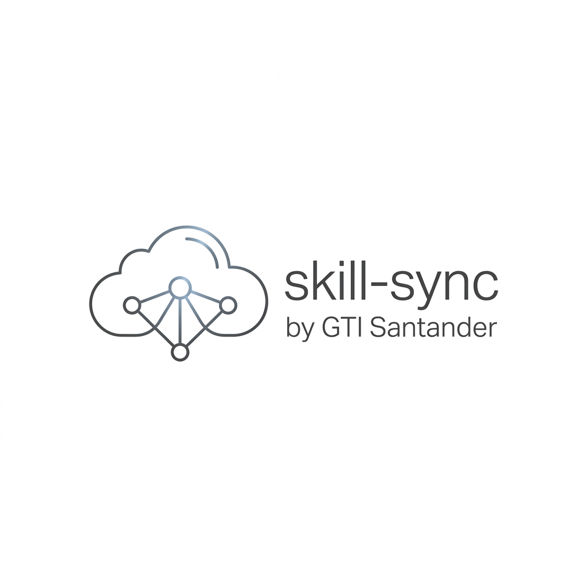

<div align="center">



**your skills, on every machine you work from**

Built by **[GTI Santander](https://gtisantander.com)**

Install a skill once. Find it on the laptop, the desktop, and in whichever AI client you
open next — Claude Code, Gemini, Antigravity, Cursor, OpenCode.

[](https://github.com/DPR77/SkillSync/actions/workflows/ci.yml)
[](LICENSE)
[](https://www.python.org/)
[](https://rclone.org)

[Install](#install) · [Storage](#pick-your-storage) · [Commands](#what-you-get) ·
[Menu](#interactive-menu) · [How it works](#how-it-works) · [Safety](#safety)

</div>

---

## Before / After

<table>
<tr><th>By hand</th><th>With skill-sync</th></tr>
<tr valign="top"><td>

```text
1. remember which skills you changed
2. find them in ~/.claude/skills
3. zip, upload, download on the laptop
4. unzip over the top, hope nothing
   older overwrote something newer
5. repeat for ~/.gemini, .agents, …
```

No record of which side is newer.
Overwrites are silent and permanent.

</td><td>

```console
$ python scripts/sync.py status

work (3)
  web-builder      in-sync
  seo-audit        local-newer
  grill-me         remote-only

$ python scripts/sync.py push
```

Content-hashed, so it knows which side moved.
Nothing is overwritten without a backup.

</td></tr>
</table>

---

## Install

```bash
npx skills add DPR77/SkillSync --skill skill-sync
```

That puts the skill in your client. Then run the installer once to wire up syncing —
it picks the storage, creates the categories and registers the hooks.

**macOS / Linux**

```bash
python3 scripts/install.py
```

**Windows**

```powershell
python scripts\install.py
```

Requires Python 3.8+. The installer fetches [rclone](https://rclone.org) through your
platform's package manager if it is missing (`winget`, `brew`, or the official script),
picks up your first existing rclone remote — or falls back to a local folder at
`~/CloudSkills` so you can start with no cloud account at all — creates the `work`,
`school`, `personal` categories, registers the session hooks, and installs a small
background watcher (see below) so a brand-new skill gets noticed within seconds
instead of on the next Claude Code turn.

<details>
<summary><b>Install it as a command instead of a folder of scripts</b></summary>

The scripts run straight from the skill folder and always will — that is how Claude Code
and the other clients load it. If you would rather have `skill-sync` on your `PATH`:

```bash
pip install git+https://github.com/DPR77/SkillSync   # or: pip install . from a clone
```

That gives you `skill-sync`, `skill-sync-menu`, `skill-sync-install`, `skill-sync-hooks`
and `skill-sync-watch`, each doing exactly what the matching script does:

```bash
skill-sync doctor
skill-sync push
skill-sync-menu
```

Not on PyPI — install from the repository.

</details>

<details>
<summary><b>Set it up yourself instead</b></summary>

The installer takes those decisions for you. To choose the remote and the categories
by hand:

```bash
rclone config                                     # create a remote, interactively
python scripts/sync.py setup --remote gdrive: --categories work,school,personal
python scripts/install_hooks.py                   # optional, enables automatic sync
python scripts/install_watch.py                   # optional, near-instant new-skill detection
python scripts/sync.py doctor                     # confirm everything is wired up
```

</details>

<details>
<summary><b>Second computer</b></summary>

```bash
python scripts/sync.py setup --remote gdrive: --categories work
python scripts/sync.py pull          # list what the remote holds
python scripts/sync.py pull work     # bring down one category
```

Restart your AI client afterwards so it discovers the new skills.

</details>

---

## Pick your storage

Anything rclone can reach works. skill-sync never sees your credentials — they stay in
rclone's own config.

| Storage | `--remote` looks like | Notes |
|---|---|---|
| Google Drive | `gdrive:` | asks for `drive.file` scope: only the folder it creates |
| Dropbox | `dropbox:` | |
| OneDrive | `onedrive:` | personal and business |
| S3 / Backblaze B2 | `s3:` | any S3-compatible endpoint |
| Box, pCloud, WebDAV | `box:` `pcloud:` `webdav:` | |
| Local folder or NAS | `D:\Backup` or `/mnt/nas` | no account, no login |

> [!TIP]
> A local folder on a synced drive (Dropbox, iCloud, a network share) is a perfectly good
> remote. Start there and move to a cloud provider later — `setup` is the only thing that
> changes.

---

## What you get

Every command is `python scripts/sync.py <subcommand>`. Add `--json` to `status`, `push`,
`doctor` or `merge` when a script or an AI agent is reading the output.

| Command | What it does |
|---|---|
| `status` | which skills differ from the remote, grouped by category |
| `push [skill…]` | upload what changed — `--dry-run`, `--force`, `--budget <seconds>` |
| `pull [category…]` | download by category; a bare `pull` lists what the remote holds |
| `categorize <skill> <group…>` | set a skill's groups — `--add` / `--remove` change one without disturbing the others |
| `update` | update skill-sync itself from GitHub, keeping a backup of the current version |
| `place <skill> <client…>` | copy a skill straight into another client's folder, no remote involved |
| `merge <skill>` | unified diff of `SKILL.md` between the two sides |
| `resolve <skill> --keep local\|remote` | settle a conflict, keeping a backup of the other side |
| `prune [--yes]` | the only command that deletes anything on the remote |
| `doctor` | check rclone, config, skill folders, hooks and held backups |

Exit codes: `0` success, `1` error or blocked, `2` a choice is needed from you.

---

## Interactive menu

```bash
python scripts/menu.py
```

A full-screen terminal UI over every command: checkbox lists, live filtering (`/`), arrow
or `j`/`k` navigation, per-skill detail panels, a diff viewer for conflicts, and progress
for anything that touches the network.

| Flag | Effect |
|---|---|
| `--ascii` | plain 7-bit output for consoles that cannot render the default glyphs |
| `--no-color` | no ANSI styling |
| `--json` | without a TTY, prints status data instead of refusing |

> [!NOTE]
> The menu needs a real terminal, which an AI tool call cannot provide. Inside Claude Code,
> launch it in a window of its own rather than through the `!` prefix.

---

## Where your skills live

Skills stay flat on disk, because that is the only layout the clients discover. The
grouping exists on the remote.

```text
Skill folders on this machine                  <remote>:ClaudeSkills/
  ~/.claude/skills/          Claude Code   \       manifest.json
  ~/.gemini/config/skills/   Gemini         ├─>    work/web-builder/
  .agents/skills/            Cursor, …     /       school/thesis-helper/
  ~/.claude/plugins/…/skills                       personal/recipe-notes/
```

A skill installed under any of those folders is picked up automatically, and a download
returns to the folder where that skill already lives — a skill kept under `~/.gemini` is
never duplicated into `~/.claude`.

> [!NOTE]
> Groups are labels, not folders. A skill can be in `work` and `personal` at once; only its
> first group decides which folder holds it on the remote, so adding a group moves nothing.
> `categorize <skill> <group> --add` adds one, `--remove` takes one away.

skill-sync excludes itself from `push` and `pull` — uploading the tool while it is running,
or replacing its code mid-pull, is not worth the trouble. It updates from GitHub instead.

---

## How it works

1. **Scan.** Every known skill folder is walked and each skill is content-hashed (SHA-256
   over its files). Results are cached, so repeat runs only re-read what changed.
2. **Compare.** The hash is checked against the remote's record and against the last
   version this machine synced. That third value is what separates "I changed it" from
   "they changed it" from "we both did".
3. **Transfer.** `rclone sync`, scoped to one skill folder, with `--backup-dir` so replaced
   files are kept rather than dropped.
4. **Record.** `manifest.json` is re-read and merged before every write, so a machine that
   synced in the meantime keeps its entry. An interrupted upload records whatever already
   landed and resumes next time.
5. **Repeat, automatically — but ask about brand-new skills.** Edits to a skill that has
   synced before auto-upload, within a 90-second budget, smallest first, so nothing is ever
   held up waiting on a slow link. A skill that has never been synced anywhere is different:
   nothing pushes it silently. Instead, a background watcher (`watch_new_skills.py`, started
   at login by `install_watch.py` — Startup-folder launcher on Windows, a LaunchAgent on
   macOS, a systemd `--user` unit or XDG autostart entry on Linux, no admin/root needed
   anywhere) polls every few seconds, waits for the new skill's files to stop changing
   (installers write several at once), and opens a separate console window
   (`sync.py confirm-new`) listing it with a real y/n prompt. Say yes and it pushes that
   skill; say no, or ignore the window, and it simply won't ask again for that skill unless
   it changes further — push it manually anytime with `sync.py confirm-new` or
   `sync.py push <name>`. The same brand-new-vs-already-tracked split is checked by the
   Claude Code `Stop` hook too, so it's covered even on a machine where the watcher isn't
   running yet.

---

## Safety

> [!IMPORTANT]
> The one command that deletes on the remote is `prune`, and it does nothing until you pass
> `--yes`. Everything else keeps a copy of whatever it replaced.

- **Credential scan.** Every push is checked for API keys and private key blocks (OpenAI,
  Anthropic, GitHub, AWS, Google, Slack). A hit blocks the upload and names the exact file
  and line. Documentation placeholders are ignored; a line you have judged safe takes a
  `skill-sync: allow-secret` comment, which is narrower than `--no-scan`.
- **Conflicts stop the transfer.** When both sides moved since the last sync, nothing is
  written until you run `resolve` — and the losing side is saved first.
- **Backups expire.** Replaced files go to `~/.claude/skill-sync/trash/` or
  `<remote>/.trash/` and are deleted after 30 days, so a backup tool never quietly eats
  your cloud quota. `doctor` reports how much is held.
- **No credentials of ours.** Cloud tokens live in rclone's config; skill-sync stores only
  the remote's name.

---

## Testing

```bash
python scripts/selftest.py        # 61 checks: one end-to-end story
python scripts/crud_test.py       # 92 checks: independent CRUD and edge cases
python scripts/edge_test.py       # pathological inputs
python scripts/menu.py --self-check
```

All four run on every push and pull request — Linux, macOS and Windows, Python 3.8 to
3.13 — in [`.github/workflows/ci.yml`](.github/workflows/ci.yml). The badge at the top of
this page is that workflow, not a hand-written number. They need `rclone` on `PATH` and
skip themselves cleanly without it.

`selftest.py` simulates several machines sharing one remote and walks the whole life cycle
in order: setup, group, push, selective pull, edit and re-push, conflict detection and
resolution, the credential guard, prune safety, hook installation, consolidation of the
older manifest layout, skills living outside the primary folder, and the menu's rendering
in both glyph modes.

`crud_test.py` is the opposite shape — many small independent checks, each with its own
throwaway remote, so one failure never hides the rest. It covers the edge cases: empty
skills, unicode names, large files, `.skillignore`, concurrent pushes fighting over the
lock, and interrupted transfers.

Both touch nothing outside a temporary directory: the real skill folders and remote are
redirected with environment variables.

---

## Troubleshooting

`python scripts/sync.py doctor` first — it reports rclone, the config, which skill folders
were found, whether the hooks are installed, whether a lock is held, and how much backup
data is stored. Known failure modes and how to recover a file from `.trash` are in
[`references/troubleshooting.md`](references/troubleshooting.md); per-provider setup is in
[`references/providers.md`](references/providers.md).

---

<div align="center">

**[Providers](references/providers.md)** · **[Troubleshooting](references/troubleshooting.md)** ·
**[Skill definition](SKILL.md)**

Built by [GTI Santander](https://gtisantander.com) — MIT licensed.

</div>
